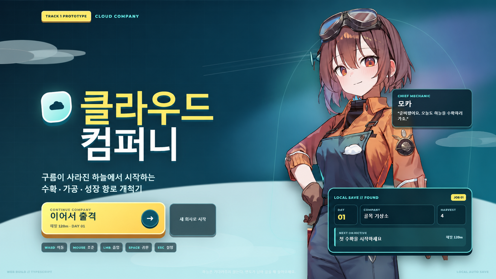
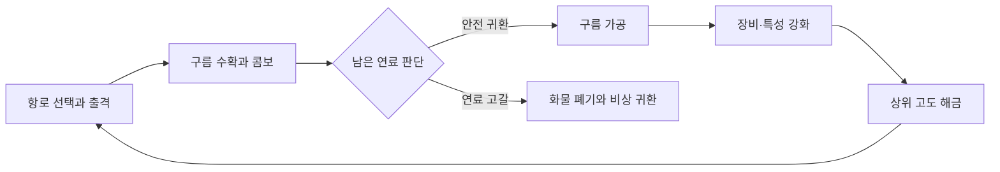

<div align="center">

# 클라우드 컴퍼니

### 구름이 사라진 하늘에서 시작하는 수확·가공·성장 항로 개척기

TypeScript와 Canvas 2D로 제작한 브라우저 기반 액티브 인크리멘탈 게임입니다.

[게임 플레이](https://jaepaly.github.io/OpenAiGame/) · [OpenAI Sites 배포판](https://cloud-company-game-2026.jaepaly.chatgpt.site/) · [대회 제출 자료](./SUBMISSION.md)

</div>



## 프로젝트 소개

《클라우드 컴퍼니》는 비행선을 직접 조종해 구름을 연속으로 수확하고, 회수한 구름을 가공해 회사를 성장시키는 게임입니다. 단순히 기다리기만 하는 방치형 구조 대신 **직접 조작하는 수확의 손맛**, **연료가 바닥나기 전 귀환해야 하는 긴장감**, **가공과 영구 성장으로 이어지는 반복 보상**을 하나의 짧은 플레이 루프로 묶었습니다.

| 항목 | 내용 |
| --- | --- |
| 장르 | 액티브 인크리멘탈 · 수확 액션 · 성장 시뮬레이션 |
| 플랫폼 | 데스크톱 및 모바일 웹 브라우저 |
| 개발 형태 | 개인 개발 · OpenAI Game 2026 Track 1 프로토타입 |
| 엔진 | 별도 게임 엔진 없이 TypeScript + Canvas 2D로 구현 |
| 저장 | 브라우저 `localStorage` 자동 저장 |

## 핵심 플레이 루프



구름을 많이 모으는 것만으로는 충분하지 않습니다. 이동과 흡입이 모두 연료를 소비하기 때문에, 플레이어는 마지막 구름 무리를 더 노릴지 안전하게 귀환할지 계속 판단해야 합니다. 귀환한 구름은 즉시 돈이 되지 않고 가공 설비를 거쳐 완제품과 성장 재료로 전환됩니다.

## 주요 특징

### 수확의 리듬과 도파민

- 마우스로 흡입 방향을 조준하고 `WASD`로 비행선을 독립 조작
- 수확음의 음정, 압축 폭발, 충격파가 콤보에 맞춰 단계적으로 상승
- 5연속 `PRESSURE SURGE`, 전 화면 수확 모드 `SKY FEVER`
- 군집의 핵을 터뜨리면 주변 구름이 순차 수확되는 `CASCADE`
- 구름이 부족해 흐름이 끊기지 않도록 최소 재고선과 반응형 보충 전선 적용

### 위험과 보상이 있는 귀환

- 이동과 흡입에 공통으로 소모되는 연료 시스템
- 연료가 0이 되면 해당 비행의 화물을 잃는 비상 귀환
- 남은 연료가 적을 때 발동하는 경고와 막판 수확 연출
- 항로와 고도마다 달라지는 연료 압박, 구름 분포와 보상 배율

### 수확 이후에도 이어지는 공장 운영

- 비행 중에도 계속 작동하는 구름 가공 대기열
- 처리 속도, 동시 가공 라인과 묶음 용량을 확장하는 설비 강화
- 빠른 현금화, 대량 정제, 특성 재료 추출 등 목적이 다른 계약
- 시험관형 응축 설비와 컨베이어로 진행 상황을 시각화한 가공동

### 장기 성장과 콘텐츠

- 뭉게·비·전기·빙정·태양·오로라로 이어지는 6단계 구름
- 흡입, 피버, 자동화, 연료·항법으로 나뉜 42개 단일 해금 특성
- 특성망 완성 후 속도·흡입력·연료·드론·가치를 계속 높이는 무한 연구
- 장비 단계에 따라 실제 외형이 달라지는 비행선
- 서로 다른 지형과 날씨를 가진 6개 고도 및 항로별 전용 이벤트
- 모카와 소나를 중심으로 회사의 재건과 인공 기압장의 비밀을 다루는 스토리

## 플레이 방법

| 입력 | 동작 |
| --- | --- |
| `WASD` / 방향키 | 비행선 이동 |
| 마우스 이동 | 흡입 방향 조준 |
| 마우스 왼쪽 버튼 유지 | 구름 흡입 |
| `Space` | 기지 귀환 절차 시작 |
| `Esc` | 설정 및 일시정지 |

피버 중에는 비행 속도와 흡입 범위가 크게 확장됩니다. 구름을 연속으로 수확해 피버 게이지와 콤보를 유지하는 것이 빠른 성장의 핵심입니다.

## 기술적 문제와 해결

| 문제 | 해결 방식 | 결과 |
| --- | --- | --- |
| 후반 흡입력이 강해지면 필드가 잠시 비어 플레이 흐름이 끊김 | 고도·출격·특성에 따라 계산되는 최소 구름 재고선과 최근 수확량 기반 보충 로직 구현 | 성장할수록 더 많은 구름이 공급되는 물량 성장 확보 |
| 연쇄 수확 중 체력이 0인 구름과 효과가 한꺼번에 누적되어 프레임 저하 발생 | 수확 즉시 게임 배열에서 제거하고 연쇄 큐의 처리 간격을 제어했으며, 파티클·충격파 상한과 수확음 배치 처리 적용 | 대량 수확 상황의 지연과 오디오 중첩 감소 |
| 레벨업 선택창이 수확 도중 반복적으로 나타나 핵심 리듬을 방해함 | 비행 중 팝업을 제거하고, 귀환 후 구름을 재료로 소비하는 영구 특성망으로 재설계 | 플레이 중단 없이 수확에 집중하고 장기 목표는 유지 |
| 여러 시설 창을 오간 뒤 출격 버튼이 입력을 받지 못하는 경우 발생 | 오버레이 종료 시 상태와 `pointer-events`를 일관되게 정리하고 시설별 닫기 동작 통일 | 정비소 허브의 메뉴 전환 안정성 향상 |
| 화면 흔들림과 효과음이 누적되어 피버 구간의 피로도가 높음 | 피버 중 흔들림과 히트 스톱을 제한하고 시각 효과 중심으로 속도감 재조정, 효과 강도 설정 추가 | 연속 수확의 타격감은 유지하면서 시각적 피로 감소 |
| 배포 환경과 로컬 환경의 화면 비율 차이로 HUD가 겹침 | `clamp()`, `dvh`, 미디어 쿼리와 가변 패널 크기를 사용한 반응형 레이아웃 적용 | 다양한 데스크톱 해상도와 모바일 화면 대응 |

## 기술 구성

| 영역 | 기술 |
| --- | --- |
| 게임 로직 | TypeScript, Canvas 2D API |
| 화면 구성 | HTML, CSS, 반응형 레이아웃 |
| 사운드 | Web Audio API 기반 실시간 합성 및 수확음 배치 처리 |
| 상태 관리 | 직렬화 가능한 게임 상태와 `localStorage` 자동 저장 |
| 개발·빌드 | Vite, TypeScript strict mode, pnpm |
| 배포 | GitHub Pages, OpenAI Sites |
| 캐릭터 아트 | NovelAI로 생성 후 개발자가 방향 선정 및 게임용 편집 |

프레임워크나 외부 게임 엔진을 사용하지 않고 입력, 업데이트, 렌더링, 오디오와 영구 저장 루프를 직접 구성했습니다. 수치와 콘텐츠 정의는 코드에서 분리해 밸런스 조정이 게임 로직에 미치는 영향을 줄였습니다.

## 프로젝트 구조

```text
OpenAiGame/
├─ src/
│  ├─ game.ts        # 게임 루프, 수확·연료·드론·렌더링·오디오
│  ├─ config.ts      # 구름, 항로, 장비, 특성 및 밸런스 데이터
│  ├─ main.ts        # HUD, 정비소, 가공동, 스토리와 화면 전환
│  ├─ styles.css     # 게임 UI, 애니메이션과 반응형 레이아웃
│  ├─ types.ts       # 게임 상태와 콘텐츠 타입 정의
│  └─ assets/        # 캐릭터 일러스트
├─ docs/images/      # README 및 포트폴리오 이미지
├─ scripts/          # 배포 결과물 준비 스크립트
├─ SUBMISSION.md     # 대회 제출 설명과 데모 구성
└─ vite.config.ts    # Sites·GitHub Pages 빌드 설정
```

## 로컬 실행

```bash
pnpm install
pnpm dev
```

프로덕션 빌드와 미리보기:

```bash
pnpm build
pnpm preview
```

GitHub Pages용 결과물은 별도 base path를 적용해 생성합니다.

```bash
pnpm build:pages
```

## Codex와의 협업

개발자는 게임의 콘셉트와 핵심 재미, 성장 구조, 아트 방향을 결정하고 실제 플레이 테스트를 통해 문제와 수정 우선순위를 판단했습니다. Codex는 이 피드백을 바탕으로 TypeScript 시스템을 구현하고, UI를 반복 개편하며, 재현된 버그의 원인을 찾아 수정하는 공동 개발 도구로 사용했습니다.

특히 “구름을 연속으로 수확하는 흐름이 끊기지 않아야 한다”는 기준을 중심으로 레벨업 팝업을 영구 특성망으로 바꾸고, 구름 재고선·가공 대기열·연료 기반 귀환 구조를 단계적으로 설계했습니다. 사람은 **무엇이 재미있는지 판단하는 역할**, Codex는 **그 판단을 빠르게 플레이 가능한 코드로 만들고 검증하는 역할**을 담당했습니다.

## 현재 상태

OpenAI Game 2026 Track 1 제출을 위해 제작한 플레이 가능한 프로토타입입니다. 타이틀부터 6단계 고도, 스토리 피날레와 무한 연구까지 하나의 진행 흐름으로 완주할 수 있으며, 브라우저에서 별도 설치 없이 실행됩니다.
